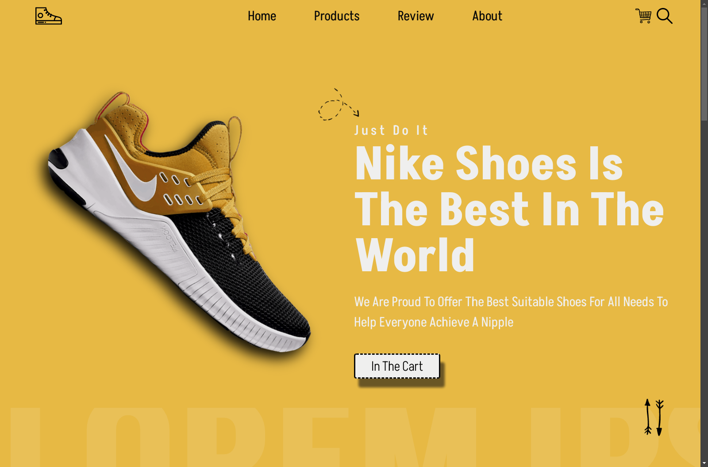
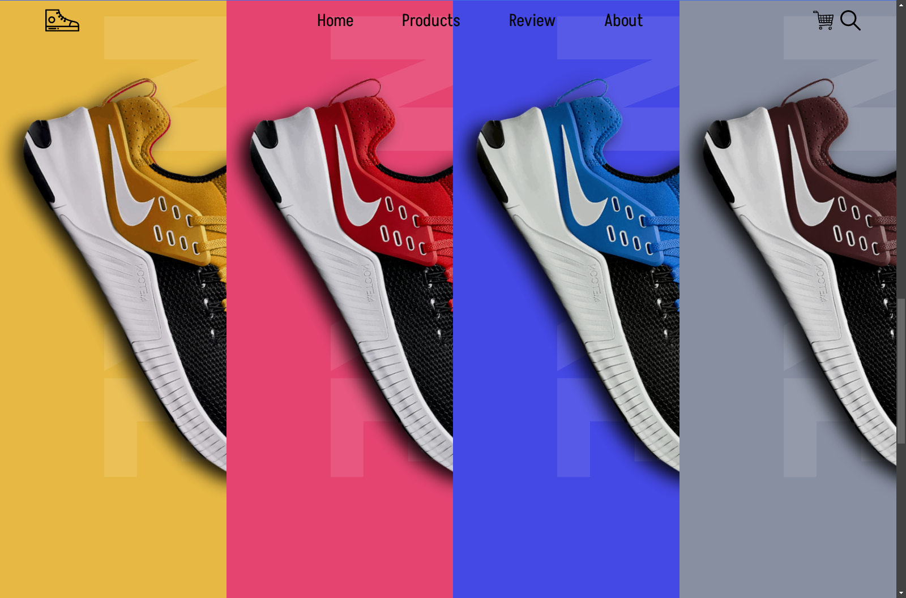
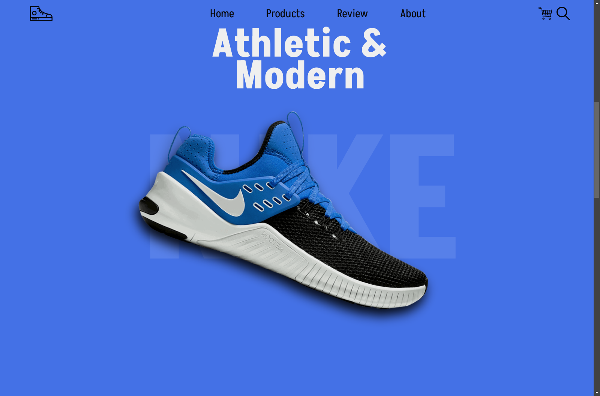

# SoleCraft Customs Nike 
> Start at: May 23, 2022

## Project Description

This is a landing page for an e-commerce website designed to showcase a mock project for a custom Nike shoe store. The goal of this project is to create a visually appealing and responsive landing page that highlights the concept of modern custom-designed Nike shoes, The page includes interactive elements and modern UI/UX design principles.


### Screenshot





### Links

-   [Live Site URL](https://ymhaah.github.io/Nike-store/)
-   Icon website: [svgrepo](https://www.svgrepo.com/)

### Built with

-   HTML
-   CSS
-   JS

### What I learned

`color-scheme meta tag`

```html
<meta name="color-scheme" content="dark light" />
```

`aria-labelledby`
```html
<section aria-labelledby="Introduction to page"></section>
```

`image lazy loading`
```html

```

`CSS trices (filter - writing-mode)`
```css
img {
	filter: drop-shadow(0 20px 15px rgba(10, 10, 10, 0.9)) brightness(90%)
		contrast(110%) grayscale(10%);
}
h3 {
	writing-mode: vertical-rl;
}
```

`js observer`
```js
let options = {
	root: null,
	threshold: 0,
	rootMargin: "",
};
let observer = new IntersectionObserver(function (entries, observer) {
	entries.forEach(function (entry) {
		if (entry.isIntersecting) {
			turnBrowne.classList.add("turn-browne");
		} else {
			turnBrowne.classList.remove("turn-browne");
		}
	});
}, options);
```

### Continued development

-   html seo
-   css animation
-   js observer

### Useful resources

Check out my latest previous articles:

-   [how to make an Indestructible button?](https://dev.to/ymhaah/how-to-make-an-indestructible-button-3f2h)
-   [Top 5 Icon websites for devs and designers!!!](https://dev.to/ymhaah/top-5-icon-websites-for-devs-and-designers-53mh)
-   [30-Day React Learning Journey!](https://dev.to/ymhaah/series/20473)


## Author
Follow me on:

-   professional links:
    - [Twitter / X](https://twitter.com/hafanwy)
    - [LinkedIn](https://www.linkedin.com/in/youssef-hafnawy/)
-   Hire me:
    -   [UpWork](https://www.upwork.com/freelancers/~01acd8e5370e5646aa)
-   Blog:
    -   [Medium](https://medium.com/@ymhaah250)
    -   [Dev.to](https://dev.to/ymhaah)
